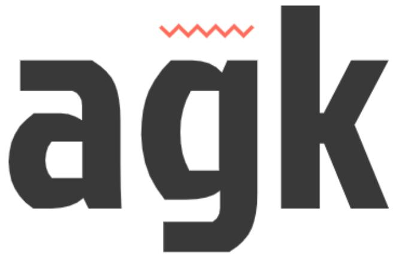

<p align="center">
  
</p>

# Agk Tool (being reversed stands for "Knowledge Graphs Applications")
A library for building recommendation systems.
## Example of usage
To cross-validate implemented models of knowledge graph representation on a dataset and calculate metrics for comparing multiple solutions (being in the root project directory):
0. Setup dependencies
```sh
sudo apt-get install libblas-dev libmongoc-dev libbson-dev libcurl4-openssl-dev uuid-dev -y
```
1. Compile the source code
```sh
swift build --product agk
```
2. Run tesing process (for the complete list of supported models and cross-validation parameters see file `Sources/agk/main.swift`)
```sh
.build/debug/agk -m transe -d truncated-dataset-normalized.txt
```
